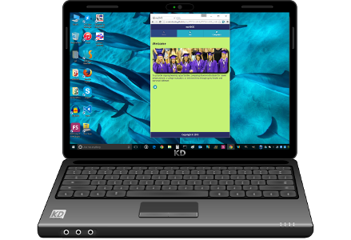

<h1>mySDCE App</h1>

 
    

        
        
    

 

    <h2>What does this app do</h2>
        <h4>
            

                Learn All About Classes at San Diego Community Colleges.
            

        </h4>
    
    <h2>Features</h2>
        <h4>
            <ol>
                <li>Customize or Get Directions</li>
                <li>Check the class schedule</li>
                <li>Info about Art Classes, Calendar, Catalog</li>
                <li>Computer Classes</li>
            </ol>
        </h4>

    <h2>Getting the App</h2>
        <h4>
            

                This app is available two ways:
            

            <ol>
                <li>
                    
                    On the <a href="http://scottnakada.github.io/mySDCE/webMySDCE/mobile_website/index.html">web</a>:  
                </li>
                <li>
                    
                    On Android devices through the
                    <a href="http://www.amazon.com/Quickstart-Prototypes-mySDCE-Nakada/dp/B013W3P9B6/ref=sr_1_3?s=mobile-apps&ie=UTF8&qid=1440195111&sr=1-3&keywords=mysdce&pebp=1440195117698&perid=11FB0E2JS7A86MM2SYKC">
                        Amazon Apps Store
                    </a>.
                </li>
            </ol>
        </h4>